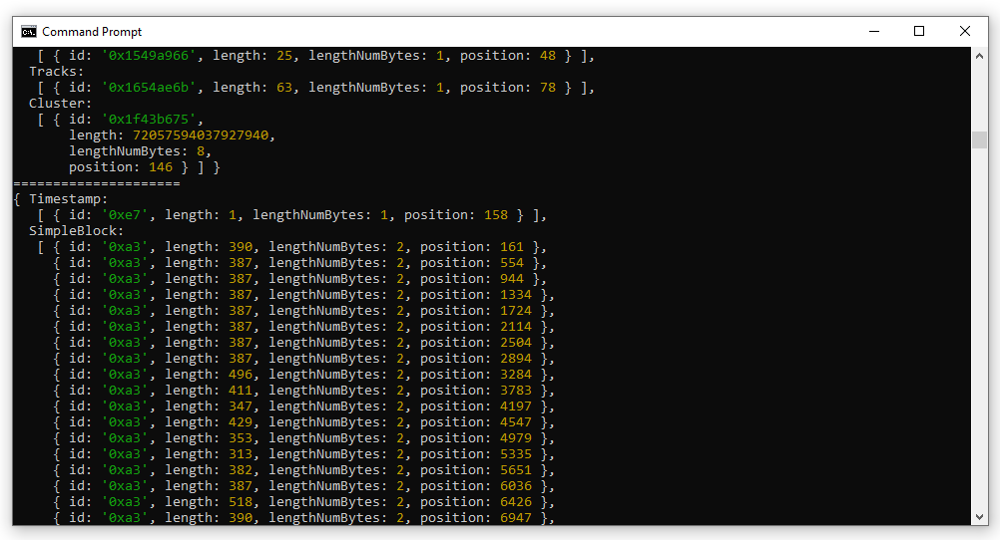

The files here in this folder are used to explore EBML, Matroska containers and extracting the audio data from a .webm file. You'll need node.js to run the javascript. I also recommend Frhed for checking the hexdump of webm/weba files.    
    
Right now the code can at least locate where the audio data is (I think). The next step is to isolate the data and check if it's accurate (via using ffmpeg to extract opus data from the file and comparing maybe?). Then perhaps I can try converting that to an ogg file or an audio format.    
    
   
    
special thanks to <a href='https://www.darkcoding.net/software/reading-mediarecorders-webm-opus-output/'>Graham King</a> for providing a great tutorial on understanding parsing webm data.    