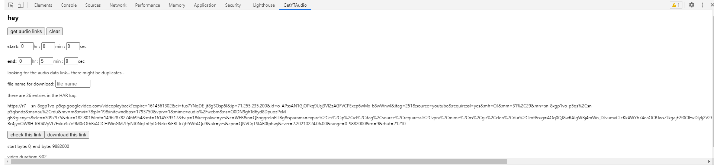

## getYTAudio
    
a Chrome extension that extends the developer tools inspector with a new panel that helps grab the link to the audio data for a particular YouTube video so you can download just the audio!    
    
    
    
The first link is the original, while the second has the range parameter modified. These links can then be accessed to download the audio data (so far I've seen only webm and mp4, which can be easily converted using various online services).    
    
~~Depending on how much or what part of the audio you want, the range should be changed accordingly.~~ Actually, it seems like the audio won't be streamed (and so you can't collect the data) if you don't start the range at 0, unfortunately.    
    
After you request the audio link, you may get a bunch of duplicates due to multiple requests in the HAR file that are basically the same (since the audio seems to be streamed in chunks).    
    
instructions:    
load the extension.    
go to the YouTube video that has the audio you're interested in.    
open up developer tools (the inspector window) and click on the tab that says "My Panel".    
click on the 'get audio link' button whenever you feel like it. if it doesn't yield any links, try clicking again and/or refreshing the page.    
the links should lead you to an audio player, from which you can download the audio you wanted!       
